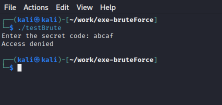
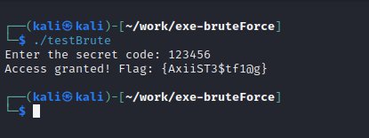
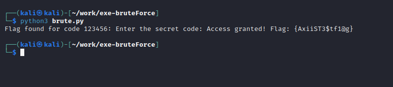

# exe-BruteForce
Brute force exe files which are dependant on a single password and have a standard error output

## Use Case
The main use case of this tool is in cracking passwords inside an executable application that takes the user's password or code as input and then displays an error message if it is wrong.These types of applications can be commonly found in Capture the Flag events.

Below is an example image of how one such application behaves:

Below is an example of entering correct code to that application:

## How to Use the tool

The tool can be used by simply entering **python3 brute.py** 

**Note:For this to properly work you should check the error output message in your executable file and   accordingly change it to reflect the message being displayed in your own executable application which you are trying to crack**

**The word List and the path of the executable file which you are using must also be changed accordingly as mentioned inside the brute.py code**

## Testing

testBrute.c source code and testBrute exe application are included here to test the functional working of this tool.
